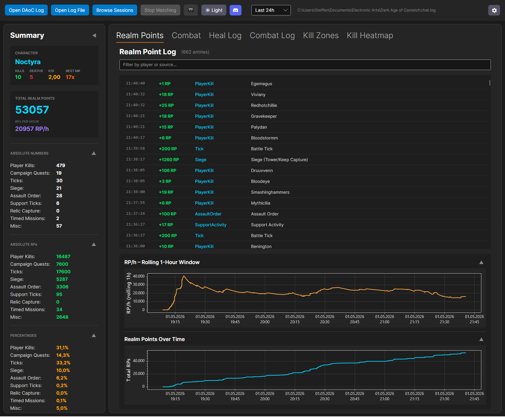

# DAoC Log Watcher

> **Beta** — core features work, some RP categories may be misidentified. Please report issues on the [Issues](https://github.com/ZZerker/DAoCLogWatcher/issues) page.

A real-time Realm Point tracker for **Dark Age of Camelot (Eden)**. Load your `chat.log` and instantly see how many RPs you're earning, where they're coming from, how fast they're rolling in, and your kill/death stats — all updated live as you play.



---

## Features

- **Live log tracking** — reads your chat log as the game writes it, no manual refreshing needed
- **RP breakdown** by source:
  - Player Kills, Campaign Quests, Battle Ticks
  - Siege (Tower & Keep Captures), Assault Orders
  - Support Activity, Relic Captures, Timed Missions
- **RP/h meter** — rolling realm points per hour, updated every 5 seconds
- **Character detection** — type `/stats` in-game and the app identifies your character, then shows live kills, deaths, and K/D ratio
- **Charts** — cumulative RP over time and rolling RP/h graph, both collapsible
- **Time filters** — limit the log to a preset window (1h–1 week) or a custom hours/minutes value
- **Screenshot to clipboard** — capture the full window to your clipboard with one click
- **Auto-update** — the app checks for new releases on startup and prompts you to install them
- **Dark & Light theme** — toggle any time
- **Windows & Linux** supported (Linux via Wine / Lutris / Flatpak)

---

## Installation

### Windows

1. Go to the [Releases](https://github.com/ZZerker/DAoCLogWatcher/releases/latest) page
2. Download [`DAoCLogWatcher-win-Setup.exe`](https://github.com/ZZerker/DAoCLogWatcher/releases/latest/download/DAoCLogWatcher-win-Setup.exe)
3. Run the installer — the app installs and launches automatically
4. Future updates are applied from within the app (no re-downloading needed)

### Linux (Flatpak)

1. Go to the [Releases](https://github.com/ZZerker/DAoCLogWatcher/releases/latest) page
2. Download the `.flatpak` bundle
3. Install it:
   ```bash
   flatpak install --user DAoCLogWatcher.flatpak
   ```
4. Run it:
   ```bash
   flatpak run io.github.zzerker.DAoCLogWatcher
   ```

### Linux (manual / Wine)

1. Download the Linux archive from the [Releases](https://github.com/ZZerker/DAoCLogWatcher/releases/latest) page
2. Extract and run `DAoCLogWatcher.UI`
3. Make sure the [.NET 10 Runtime](https://dotnet.microsoft.com/en-us/download/dotnet/10.0) is installed

---

## Getting Started

### 1. Enable chat logging in DAoC

In-game, open the chat window and type:

```
/chatlog
```

This creates (or resumes) `chat.log` in your DAoC documents folder. You only need to do this **once per session** — the file persists between logins.

### 2. Open your log

- Click **Open DAoC Log** — the app auto-detects your `chat.log` based on the default install path
- Or click **Open Log File** to browse manually

The app starts reading immediately and updates the display as new lines arrive.

### 3. Identify your character

Type `/stats` in-game at any point. DAoC writes a line like:

```
Statistics for Caranthir this Session:
```

The app detects this and displays your character name in the sidebar with live kill/death/K/D stats. Any kill or death events that occurred earlier in the session are retroactively counted once your name is known.

---

## Time Filters

| Filter | What it shows |
|---|---|
| **All time** | Everything in the log file |
| **Last 1 week** | Only entries from the past 7 days |
| **Last 48h / 24h / 12h / 6h / 3h / 2h / 1h** | Rolling window of that duration |
| **Custom…** | Opens a dialog — enter any number of hours and minutes |

Filters are applied from the moment you open a log — useful when your `chat.log` spans many days and you only care about recent activity. Changing the filter while the app is already watching automatically restarts the session with the new window.

---

## Character Detection & Kill Tracking

The app detects your character by watching for the `/stats` output block in the log:

```
Statistics for Caranthir this Session:
Total RP: ...
```

Once detected, your character name appears at the top of the sidebar with:
- **Kills** — times you appeared as the killer in a kill line
- **Deaths** — times you appeared as the victim
- **K/D** — kill/death ratio

**Notes:**
- Kill/death lines earlier in the session are retroactively applied as soon as your name is detected.
- If you check another player with `/stats player <name>`, the app uses a frequency heuristic to ignore one-off lookups and keep your character name correct.
- Stats reset each time you click **Open DAoC Log**.

---

## Log File Location

| Platform | Default path |
|---|---|
| Windows | `%USERPROFILE%\Documents\Electronic Arts\Dark Age of Camelot\chat.log` |
| Linux (Wine default) | `~/.wine/drive_c/users/<user>/My Documents/Electronic Arts/Dark Age of Camelot/chat.log` |
| Linux (Lutris) | `~/Games/dark-age-of-camelot/drive_c/users/<user>/My Documents/Electronic Arts/Dark Age of Camelot/chat.log` |

If **Open DAoC Log** can't find the file automatically, use **Open Log File** to browse to it.

---

## ⚠️ Known Issues (Beta)

| Feature | Status |
|---|---|
| RP source categorization | Some log line formats are not yet parsed — sources may be misidentified or fall into "Other" |
| Percentage breakdown | Derived from categorized RPs, so any misidentification above carries through |
| Kill / death count | Requires at least one `/stats` in the log — events before the first `/stats` are retroactively counted once the name is detected |

Please report unexpected behaviour on the [Issues](https://github.com/ZZerker/DAoCLogWatcher/issues) page.

---

## Building from Source

Requirements: [.NET 10 SDK](https://dotnet.microsoft.com/en-us/download/dotnet/10.0)

```bash
git clone https://github.com/ZZerker/DAoCLogWatcher.git
cd DAoCLogWatcher
dotnet build
dotnet run --project DAoCLogWatcher.UI
```

Run tests:

```bash
dotnet test DAoCLogWatcher.Tests/DAoCLogWatcher.Tests.csproj
```
