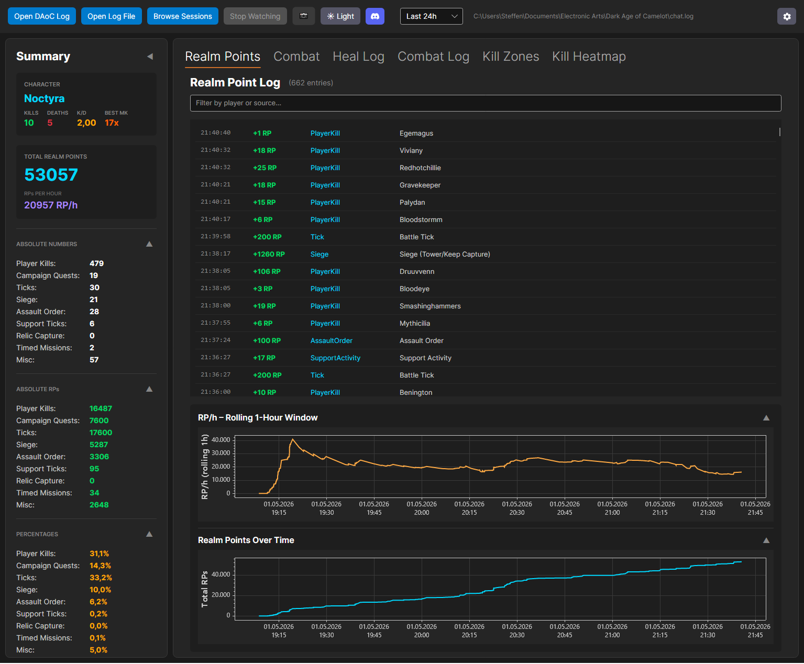

# DAoC Log Watcher


[](https://discord.gg/V7Z5y3Ke9v)

A real-time tracker for **Dark Age of Camelot (Eden)**. Point it at your `chat.log` and see how many realm points you are earning, where they come from, how fast they roll in, live combat numbers, and a server-wide frontier map with kill heat, keep ownership, fights, campaign events and relics pulled from the Eden warmap. Everything updates while you play, in the main window and in an in-game overlay.



## Install and run (TL;DR)

| Platform | Download | Notes |
|---|---|---|
| **Windows** | [`DAoCLogWatcher-win-Setup.exe`](https://github.com/ZZerker/DAoCLogWatcher/releases/latest/download/DAoCLogWatcher-win-Setup.exe) | Installs and launches, updates itself from inside the app |
| **Linux** | [`DAoCLogWatcher.AppImage`](https://github.com/ZZerker/DAoCLogWatcher/releases/latest) (recommended) | `chmod +x` and run, updates itself in place, sets up the KDE Wayland overlay rule automatically |

Then, in the game:

1. Type **`/chatlog`** once per session so DAoC writes `chat.log` to disk
2. Type **`/stats`** so the app can pick up your character name
3. In the app, click **Browse Sessions** and pick your current session (or **Open DAoC Log** to tail from now)

Beta builds: **Settings > Updates > Use pre-releases**. Flatpak and a plain archive are also available, see [Installation details](#installation-details).

---

## Features

**Realm points**
- Live RP tracking as the game writes the log, broken down by source: player kills (with victim), campaign quests, battle ticks, tower and keep captures, assault orders, support, relic captures, timed missions
- Rolling 1-hour RP/h plus the session average, cumulative RP and RP/h charts
- Session browser to replay any past session from `chat.log` by date and time, time filters for live tailing ("1h ago" to "1 week ago" or custom)
- Session history with totals, best session, best RP/h, and a per-session list filterable by character

**Dashboard**
- Widget grid you can show/hide, drag to reorder and resize (XS to XL), saved as named profiles per character or playstyle
- Widgets: RP and session stats, K/D, best multi-kill, hottest zone, RP sources, damage output, top opponents/spells/healers, damage taken, heals done, zone activity, RP/heal/combat logs, minimap, campaign events

**In-game overlay (OSD)**
- Always-on-top panel with character name and live indicator, total RP and RP/h, damage and heal totals, your last kills, and player messages (`/send`) as a toast
- Lock it to make it click-through, unlock to drag it and set opacity; position and opacity are remembered and the overlay reopens on next start
- Windows and Linux/X11 out of the box, KDE Plasma Wayland via a window rule (applied automatically by the AppImage), see [Linux overlay on Wayland](#linux-overlay-on-wayland)

**Combat**
- Damage dealt and taken, heals given and received, miss/block and resist rates, crit count and crit rate per attack type, average damage per weapon, spell and style
- Melee style attribution, DoT ticks folded into live-updating per-target entries, AoE nukes and DoT windows resolved against a bundled spell database
- NPCs are excluded from combat and heal stats so RvR numbers stay clean
- Scrollable combat and heal logs with live filters

**Frontier map and warmap**
- Kill heatmap of every kill message on the server (not only yours) with keep and tower icons coloured by owner, burning keeps, active fights and group positions
- Campaign events (spawns, missions) as a widget and as map markers with "show on map", and relic ownership drawn on the map and in a relic panel using Eden's icons
- Zone activity ranking and a global kill-rate chart for the session
- All of this streams from the Eden warmap WebSocket, nothing to do in-game

**Quality of life**
- Player message toasts in the main window and overlay with configurable duration
- Chat log maintenance: see size, line count and age, and trim sessions older than 1/3/6/12 months into `chat-archive.zip` without ever splitting a session
- Dark and light theme, multi-kill and AoE highlighting, screenshot to clipboard, opens on the secondary monitor when there is one, window position and size remembered
- Auto-update with an optional pre-release channel, categorized settings dialog, crash log folder reachable from Settings > Log File > Diagnostics

---

## Installation details

### Windows

1. Download [`DAoCLogWatcher-win-Setup.exe`](https://github.com/ZZerker/DAoCLogWatcher/releases/latest/download/DAoCLogWatcher-win-Setup.exe) from the [Releases](https://github.com/ZZerker/DAoCLogWatcher/releases/latest) page
2. Run it. The app installs into your user profile and starts
3. Updates are downloaded and applied from within the app

### Linux

**AppImage (recommended).** It is the only Linux build that updates itself and that configures the KDE Wayland overlay rule for you.

```bash
chmod +x DAoCLogWatcher.AppImage
./DAoCLogWatcher.AppImage
```

Updates replace the AppImage in place. To also receive beta builds, enable **Settings > Updates > Use pre-releases**.

**Flatpak.** Pick this if you want the sandbox. The in-app updater is disabled in this build, so new versions mean re-downloading the bundle, and the KDE Wayland rule has to be imported by hand (see below).

```bash
flatpak install --user DAoCLogWatcher.flatpak
flatpak run io.github.zzerker.DAoCLogWatcher
```

**Plain archive.** Extract the Linux archive from the Releases page and run `DAoCLogWatcher.UI`. Requires the [.NET 10 Runtime](https://dotnet.microsoft.com/en-us/download/dotnet/10.0). No auto-update.

> Playing on Wayland? Read [Linux overlay on Wayland](#linux-overlay-on-wayland) before enabling the overlay.

---

## Using the app

### Enable chat logging

In-game, type `/chatlog`. This creates or resumes `chat.log` in your DAoC documents folder. Once per session is enough, the file persists between logins.

### Open your log

- **Browse Sessions** lists every play session found in `chat.log` by date and time range. Pick one to replay it; picking the current session keeps tailing the file live
- **Open DAoC Log** auto-detects `chat.log` from the default install path and tails it from now
- **Open Log File** lets you browse to the file manually

### Identify your character

Type `/stats` in-game. DAoC writes `Statistics for <name> this Session:`, the app picks up the name, shows it in the sidebar and retroactively attributes earlier events. Checking other players with `/stats player <name>` does not confuse the detection. Stats reset each time you open a log.

### Time filters

Time filters set a starting point in the past for live tailing ("1h ago" up to "1 week ago", or a custom hours/minutes value) and include everything from there on. Changing the filter while watching restarts the session at the new starting point. For a specific past session, Browse Sessions is the better tool.

### Dashboard profiles

1. On the Dashboard tab, enter **Customize** mode: drag tiles to rearrange, drag the corner grip to resize, show or hide widgets from the list
2. Click **Save Profile** and give it a name ("Solo Caster", "RvR Grind", "Heal Support")
3. Switch layouts with the profile dropdown, **Save As** duplicates, **Delete** removes
4. Widgets added in app updates are appended to existing profiles automatically

### Log file location

| Platform | Default path |
|---|---|
| Windows | `%USERPROFILE%\Documents\Electronic Arts\Dark Age of Camelot\chat.log` |
| Linux (Wine default) | `~/.wine/drive_c/users/<user>/My Documents/Electronic Arts/Dark Age of Camelot/chat.log` |
| Linux (Lutris) | `~/Games/dark-age-of-camelot/drive_c/users/<user>/My Documents/Electronic Arts/Dark Age of Camelot/chat.log` |

If auto-detection fails, use **Open Log File** or set the path under **Settings > Log File**.

### Chat log maintenance

`chat.log` grows forever. **Settings > Log File > Chat log** shows its size, line count and age span, and lets you trim everything older than 1, 3, 6 or 12 months into `chat-archive.zip` next to it. Cuts land on session boundaries only, and the archive contains a plain `chat.log` you can open in the app again.

### Combat and heal tracking

Parsing covers weapon attacks, melee styles, spells, crits, heals, misses, blocks and resists. DoT spells and AoE nukes are looked up in a bundled spell database so ticks and multi-target hits land on the right spell; a two-tier attribution (pending cast within 4.5s, then last confirmed spell) handles multi-hit abilities and DoT ticks.

Coverage depends on log line formats. If a class or ability is attributed wrongly, [open an issue](https://github.com/ZZerker/DAoCLogWatcher/issues) with a log excerpt or share it on [Discord](https://discord.gg/V7Z5y3Ke9v).

---

## Linux overlay on Wayland

The app has no native Wayland backend and runs through **XWayland**. On Wayland a focused fullscreen game is stacked above normal always-on-top windows, so the overlay disappears behind the game.

### KDE Plasma (KWin)

A one-time window rule raises only the overlay into KWin's on-screen-display layer, above fullscreen. The game itself is untouched.

The **AppImage and plain archive add this rule automatically** on first launch when they detect a KDE Plasma Wayland session. The **Flatpak** build is sandboxed and cannot reach KWin's config, so import the rule yourself:

1. Download [`linux/DAoC-Overlay-KDE-Wayland.kwinrule`](linux/DAoC-Overlay-KDE-Wayland.kwinrule)
2. **System Settings > Window Management > Window Rules > Import**, choose the file, **Apply**
3. Toggle the overlay off and on from the toolbar so KWin applies the rule

Or create it by hand under *System Settings > Window Management > Window Rules > Add New*:

| Field | Value |
|---|---|
| Window class | `io.github.zzerker.DAoCLogWatcher`, Exact Match |
| Window title | `DAoC Overlay`, Exact Match |
| Layer | **Force** to `On Screen Display` |

### GNOME and other Wayland compositors

**GNOME/Mutter** has no window rules, no layer-shell, and does not let applications stay above a fullscreen window. **wlroots** compositors (Sway, Hyprland) are the same. On those desktops, log into an **X11 session** instead; the overlay works fully under X11.

- **GNOME:** at the login screen (GDM), click your name, then the gear button and pick **GNOME on Xorg** before entering your password. If it is missing, install your distro's `gnome-session-xorg` / Xorg packages
- Verify with `echo $XDG_SESSION_TYPE`, it should print `x11`

---

## Known quirks

| Area | Status |
|---|---|
| Combat parsing | Depends on log line formats; uncommon classes or abilities may need fixes. [Report issues](https://github.com/ZZerker/DAoCLogWatcher/issues) with log examples |
| Overlay on Wayland | Needs the KWin rule on KDE, an X11 session elsewhere. See [Linux overlay on Wayland](#linux-overlay-on-wayland) |
| Flatpak | No in-app updates, KWin rule must be imported manually |

---

## Community

Join the [Discord](https://discord.gg/V7Z5y3Ke9v) for bug reports, feature requests and sharing log samples.

---

## Building from source

Requires the [.NET 10 SDK](https://dotnet.microsoft.com/en-us/download/dotnet/10.0).

```bash
git clone https://github.com/ZZerker/DAoCLogWatcher.git
cd DAoCLogWatcher
dotnet build
dotnet run --project DAoCLogWatcher.UI
```

Run tests:

```bash
dotnet test --project DAoCLogWatcher.Tests/DAoCLogWatcher.Tests.csproj
```
